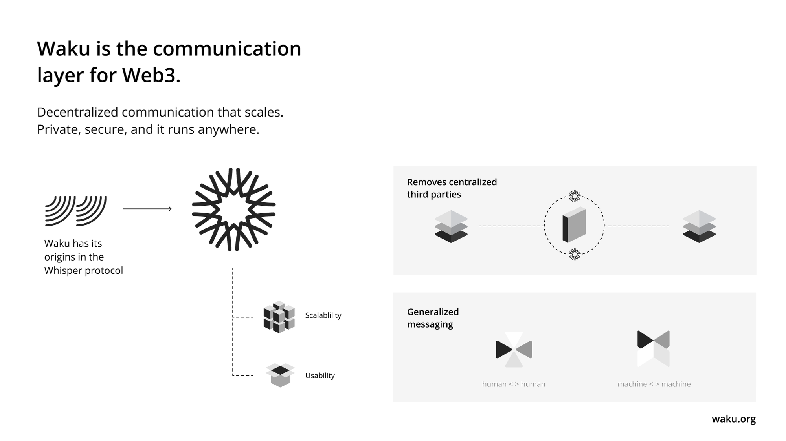
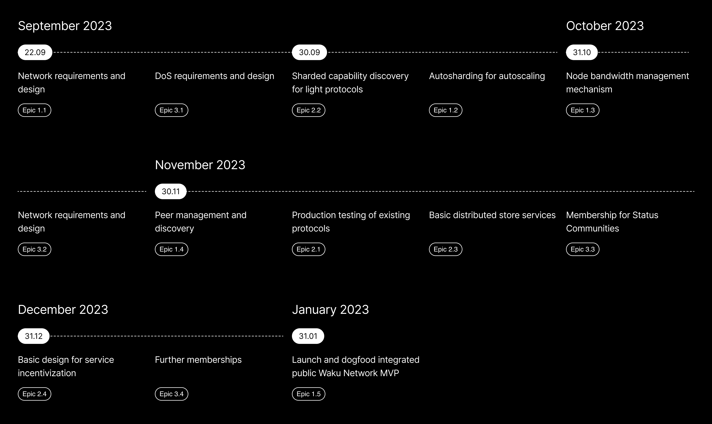

# **The Waku Roadmap**
What's an explorer without its compass, a network without roadmap?

<!--truncate-->

With the ongoing efforts of teams to scale Waku, those following Waku might be wondering where we are going. This article contains a pocket guide to our current technical goals throughout 2023 and parts of 2024. If you are primarily curious about our specific milestones and roadmap, jump [directly to it here](/waku-roadmap/#milestones--roadmap).

We do not just promise to run user messages through a Firebase backend. Do not trust us; verify instead. Follow us to learn more about our work. Have a read **[here](https://blog.waku.org/scaling-waku-progress-update/)**.

## **Waku**

What is this network, and why does it matter what we are building? Isn’t [whisper already a thing that's there to do what we aim to do](https://our.status.im/peer-to-peer-messaging-where-whisper-falls-short-and-waku-picks-up/)? 

[Waku](https://waku.org) is a decentralised, open-source suite of privacy-preserving, peer-to-peer messaging protocols. It is designed for general messaging with humans, machines, or a hybrid situation. Waku runs everywhere. On your phone, a server, or through your browser.

We apply [Waku Relay](https://docs.waku.org/overview/concepts/protocols/#relay) on top of the gossip protocol [GossipSub](https://docs.libp2p.io/concepts/pubsub/overview/) from libp2p to route messages & information with a subset of connected peers. We use this variation to increase our required levels of security and privacy. **A gossip protocol** is a peer-to-peer protocol in which nodes periodically exchange information about themselves and other associated nodes. *I recommend playing with this [(web)simulator by](https://flopezluis.github.io/gossip-simulator/) Flopezluis to understand how a gossip protocol intends to work visually.*

Currently, it is possible to use the Waku Network and join a public gossipsub network in a permissionless manner. Some projects using Waku opt to do so ([Status Desktop](https://status.im/), [Railgun](https://docs.railgun.org/wiki/learn/privacy-system/community-relayers), and [TheGraph](https://docs.graphops.xyz/graphcast/design-principles) ([GRC](https://forum.thegraph.com/t/grc-001-graphcast-a-gossip-network-for-indexers/3544/9))). This permissionless use case has had some of its own limitations.

### Limitations

The current Waku Network does have limitations due to its current development state. Limitations also arise from having a public Waku Network. These include:

* **Unscalable**: having all users on one gossipsub network means that every user needs to relay the traffic of all apps. This hurdle means that bandwidth usage increases as the adoption of Waku expands. Excluding those with limited bandwidth to fully participate in the Waku Relay network, thus resulting in usage of the light client, which subtracts resources from the overall network. As for blockchain nodes, to be fully decentralised, Waku needs to keep the resource consumption of relay nodes low so it can run on a household bandwidth.

* **No DOS/Spam protection**: Similar to the lack of scalability in normal conditions, the Waku network is not currently protected against an attacker trying to flood the network with data. This lack of spam protection can prevent everyday users from interacting on the network. 

Restricted devices such as a phone or browser come with additional limitations. They cannot easily participate in the relay network due to bandwidth consumption and are required to be mostly online. To facilitate this participation, we have a set of light client protocols (light push, filter, store) that consume resources from the network. They also have a few limitations. 

* The light client protocols claim disk space or memory for a node to provide these services.

* A node consuming these services does not contribute to the scalability of the network; it subtracts from it.

### Waku Fixes

The Waku protocols have solved the above issues with a series of fixes. These fixes include: 

 * **Sharding the network**  Instead of having one relay network, we split the “Waku network” into several relay (gossipsub) networks so that the application user does not have to relay all applications’ traffic but just the ones on the same shard.
 
* **Rate limiting** A user (or attacker) cannot flood the network beyond the maximum expected bandwidth usage. We protect abuse through our RLN DoS protection, capping publishers to 1 message / 1 second. We are also working on a dimensioning mechanism that would give publishers a maximum allocation of messages per day. Furthermore, limiting the maximum size of these messages within the overall network. 

These solutions come with a cap on scalability alongside certain caveats. The [Waku Network Gen 0](/waku-roadmap/#Waku-Network-Gen-0) aims to remove those through:

* **Automating shard allocation**: The auto-sharding protocol automatically allocates messages for an application.

* **Privacy-preserving rate limiting**: We intend to use RLN (Rate Limited Nullifier) protocol to enable rate-limiting of messages being sent by individuals over the network. Individuals get a membership by joining a zero-knowledge group on-chain. The number of members in the group is likely to be capped to guarantee maximum bandwidth usage by the network.
 
* **Optimising Nodes**: Running nodes that fully participate in the Waku Relay Network should be encouraged. We aim to do so by optimising the software and making participation permissionless. With such innovations, the community obtains these benefits: 
    * A more neutral contribution to the network, hence the backbone of a secure, scalable network.
    * Larger set of nodes to get sender and recipient k-anonymity.

---
[We have developed static sharding and opt-in messaged signing](https://blog.waku.org/scaling-waku-progress-update/) as stopgap solutions to match the Status app timeline and needs. This solution set, in addition to protocol and software improvements, should enable us to launch a public network with reasonable bandwidth usage, even under active attacks.

It’s important to note that all current and future issues need to be solved while preserving our principles:

* Private
* Modular
* Scalable
* Censorship resistant
* Portable: works on mobile and browser

## **Milestones & Roadmap**
Within Waku, we divide our work into epics and tasks within strategic milestones.

[Epics](/waku-roadmap/#gen-0-epic-summaries--keys) are larger tasks often collaborated on; compare it to an epic quest, where you’ll need a ship and crew to conquer unknown waters. Within these epic quests, each crew member gets specific tasks linked to their particular skills

We are currently tracking and planning towards four core milestones, of which Gen 0 is our primary objective. These are the milestones:

- [Waku Network Gen 0](https://github.com/waku-org/pm/milestone/1)
- [Waku Network Can Support 1 Million Users](https://github.com/waku-org/pm/milestone/4)
- [Support Many Platforms](https://github.com/waku-org/pm/milestone/2)
- [Quality Assurance processes are in place](https://github.com/waku-org/pm/milestone/3)

Waku Network Gen 0 milestone owns this priority due to its relevance to launching Waku’s MVP. Within this milestone, we have 20 epics, divided through 3 tracks
The Waku Network 1 Million milestone is a wrap-up of the work we have been committed to in H1 2023, which mainly consists of simulation, optimisation, and setup of [the 10k milestone](https://github.com/waku-org/pm/issues/12).

### Waku Network Gen 0

Why Gen 0? While this new set of protocols will enable Waku to be scalable and use reasonable resources, it is not the end of our journey. We will need to do more work to decentralise the network, especially around incentivisation and decentralising light client services. We also set a limited number of shards for now. In the future, we may “upgrade” the network to Gen 1 to either increase scalability, introduce new protocols or both.

# 

### Tracks

In Waku, we have organised our research and development work towards the Waku Network Gen 0 Milestone into three tracks; click on the title to get a more detailed summary of each involved epic in these tracks or follow the overview link to see our progress live updated directly:

- [General Track](#General-Track)
    - The foundational work focuses on creating a scalable and autosharded Waku Network. Here, we determine specifications, design, and implement strategies based on our research and development that aid in scaling the Waku Network. It also tracks our primary goal of the [Waku Network MVP launch](https://github.com/waku-org/research/issues/1). 

        | Epic & Task Overview |
        |  -------- |
        | [Link](https://github.com/orgs/waku-org/projects/2/views/2?filterQuery=E%3A+1.+)     |      |

- [Service Protocols](#Service-Protocols-Track)
    - Our focus within [Service protocols](https://docs.waku.org/overview/concepts/protocols) is required to upkeep and expand protocols such as filter, lightpush, peer exchange and store within the public network through a decentralised manner. Work within this track also involves ongoing efforts to incentivise our network.

      | Epic & Task Overview |
        |  -------- |
       [Link](https://github.com/orgs/waku-org/projects/2/views/2?filterQuery=E%3A+2.+)     |      |
    
- [DOS Protection](#DoS-Protection-Track)
    - Denial of Service (DoS) mitigation is a challenge within any network. Not only does it interfere with users’ usability, it also eats up the bandwidth of the network. Bandwidth is the most scarce resource in our network and must be shared for the network to function. This track covers consensus mechanisms such as our rate-limiting designs. However, if we still allow free traffic, how do we fairly incentivise it without exhausting the overall bandwidth t? We must implement measures to ensure the bandwidth usage is feasible for additional protocol-wide DOS protection. We need to assist node operators in maximising the usage of their resources and allocate shard support depending on current traffic so that we can assure ongoing service guarantees.

      | Epic & Task Overview |
        |  -------- |
        |  [Link](https://github.com/orgs/waku-org/projects/2/views/2?filterQuery=E%3A+3.+)     |      

---

## **Gen 0 Epic Summaries & Keys**
#### General Track

- **[Epic 1.1: Network requirements and design](https://github.com/waku-org/research/issues/6)**
    * Goal: 22 Sept 2023
    * Key Activities:
        - Determine network specifications and design.
        
In this epic, we outline the technical blueprint for the entire network. The design decisions made in this phase, such as bandwidth expectations and shard numbers, will drive subsequent developments.

- **[Epic 1.2: Autosharding for autoscaling](https://github.com/waku-org/pm/issues/65)**
    * Goal: 30 Sept 2023
    * Key Activities:
        - Design and  implement autosharding strategy.
        - Launch a limited number of shards.

Following 1.1, we track the designing and implementation of an [autosharding](https://rfc.vac.dev/spec/51/#automatic-sharding) strategy based on content topics and the design requirements established in 1.1. As stated in [our previous blog post](https://blog.waku.org/scaling-waku-progress-update#theoretical-analysis-of-scaling-gossipsub), the limitation of static sharding is that a party needs to assign shards to Communities. 

With autosharding, the protocol handles the sharding allocation in a programmatic and decentralised manner, enabling applications to route their traffic on a shard in a permissionless way while keeping the scalability [property of shardng](/waku-roadmap/#Waku-Fixes).

- **[Epic 1.3: Node bandwidth management mechanism](https://github.com/waku-org/pm/issues/66)**
    * Goal: 31 Oct 2023
    * Key Activities:
        - Implement bandwidth management to dynamically choose shards based on availability for relay nodes
        shards based on availability for relay nodes.
        - Design predictable bandwidth limits per shard.

[Having already improved our initial bandwidth usage](https://vac.dev/rlog/waku-v1-v2-bandwidth-comparison/), we expect the autosharded network to grow. Alongside the increase in traffic, we aim to deliver a mechanism to foster this continuation. While we cap bandwidth usage at a protocol level, users and operators need to have predictable bandwidth usage. This scenario is why we aim to provide software solutions to monitor and limit traffic in addition to the sharding and rate-limiting solutions we are implementing on a protocol level.

These works aim to maximise the use of resources for node operators by, for example, dynamically deciding the number of shards their node supports, depending on the current traffic.

- **[Epic 1.4: Peer management and discovery](https://github.com/waku-org/pm/issues/67)**
    * Goal: 30 Nov 2023
    * Key Activities:
        - Design transparent interaction between applications and shards.
        - Peer management system to track and discover public shared peers
        
As traffic increases, it is important that nodes and users can [discover each other.](https://vac.dev/rlog/wakuv2-apd/) Depending on the application, a given node could connect to other nodes within the required shards. They may also need to discover and remember relevant nodes serving other shards to connect to them when required.

Nodes could subscribe to shards carrying relevant content, or the peer manager could track peers from all **public** shards to discover them on demand. To facilitate this objective, the Waku research team has to enhance existing protocols to enable shard and service discovery of Waku nodes.
        

- **[Epic 1.5: Launch and dogfood integrated public Waku Network MVP](https://github.com/waku-org/research/issues/1)**
    * Goal: 31 Jan 2024
    * Key Activities:
        - Launch Waku Network MVP.
        - Gather feedback and improve.

After conquering wild, unknown territories and challenges, a chest of gold is supposedly laid at the end of a treasure map. For Waku’s Gen0 milestone, rather than hunting gold, it is the launch of the Waku Network MVP. Its initial version might have limited capacity. Still, it allows us to achieve controlled and secure growth and retain our desired properties of reasonable bandwidth usage while maintaining reliability expectations. Launching the MVP is crucial to push our understanding of the limitations of our design and decisions. We will encourage projects to build and experiment on the network. No simulations can replace the reality of field testing.

---

#### **Service Protocols Track**

- **[Epic 2.1: Production testing of existing protocols](https://github.com/waku-org/pm/issues/49)**
    * Goal: 30 Nov 2023
    * Key Activities:
        - Test and improve existing service protocols: [filter](https://rfc.vac.dev/spec/12/), [lightpush](https://rfc.vac.dev/spec/19/), and [peer-exchange](https://rfc.vac.dev/spec/34/).

As we move forward, we have added the new PostgreSQL archive backend for our store protocol and have redesigned our Filter protocol. We continue with the implementation phase for dogfooding and their use in production environments. We are also catering resources to support [Status](https://status.im) in continuing their integration of Waku for Communities. The recent integration includes Status Mobile and the new Filter protocol on both mobile and desktop.  The recent integration also includes the effort to assist usage, design of static sharding,  and opt-in message sign-in by Status Communities.

A continuing battle test for our new vessels before we fully sent them to their maiden voyage.

- **[Epic 2.2: Sharded capability discovery for light protocols](https://github.com/waku-org/pm/issues/63)**
    * Goal: 30 Sept 2023
    * Key Activities:
        - Peer selection mechanism that translates content topics to their underlying shard

Light clients are using the network differently, so it is essential to have an epic dedicated to this domain and focus, which is different from the relay node efforts that use a more mature discv5 for discovery.

As our protocols get dogfooded into the production environment, we would work on the ability to [discover peers](https://docs.waku.org/overview/concepts/peer-discovery) providing filter, lightpush, and peer-exchange services. These services translate to restricted devices and applications having peer selection mechanisms translating content topics to underlying shards.

- **[Epic 2.3: Basic distributed store services](https://github.com/waku-org/pm/issues/64)**
    * Goal: 30 Nov 2023 (integrate in 2024)
    * Key Activities:
        - Discover Store nodes for specific content topics and time ranges.
        - Service nodes to advertise their store services
        
Once we have evolved our previous service protocols, we aim to allow [store nodes](https://rfc.vac.dev/spec/13/)  to discover services for specific content topics and time ranges so their service nodes can advertise their store services. This is the first step towards decentralising the Waku Store services. To enable such distribution, we need to upgrade our protocols. Currently, we’re seeing two ways to do this:
 - Enabling store nodes to advertise the messages they store (content topics, time ranges, etc.)
 - Enabling light queries from clients that only return a message ID rather than the full payload. With the goal of identifying missing messages.

        
- **[Epic 2.4: Basic design for service incentivization](https://github.com/waku-org/pm/issues/80)**
    * Goal: 31 Dec 2023
    * Key Activities:
        - Incentivize service provision of the Waku Network
        - Tokenomics implementation

What’s a state-of-the-art ship or protocol, without the workforce or power to fuel its engines? Waku aims at long-term sustainability, with incentives for node operators to keep the ship afloat.  

To obtain ongoing decentralisation, there’s a need for neutral third parties to profit from their invested resources and effort in utilising the Waku Network. Such opportunity within these incentives will allow decentralisation that is not within our control and, thus, by its nature, decentralised and sustainable over the long term.

We work alongside Logos’s internal Tokenomics team to design a model that keeps the wind in our sails while staying true to our [principles](https://docs.waku.org/#motivation-and-goals). 

---

#### **DoS Protection Track**

- **[Epic 3.1: DoS requirements and design](https://github.com/waku-org/pm/issues/69)**
    * Goal: 22 Sept 2023
    * Key Activities:
        - Define DoS/spam protection specifications.
        - Design initial membership mechanisms.
        - [Free and or paid traffic design](https://github.com/waku-org/research/issues/10)

We do not want our ship to sink under the pressure of undesired attention. DoS and spam protection are a real problem within communication protocols and applications. Permissionless DoS protection for a generalised communication network is a complex problem. As part of this epic, we will study and set parameters for our RLN usage. We aim to answer questions regarding epoch sizes, rate-limiting, member mechanisms, and free traffic allowances. 

- **[Epic 3.2: Basic DoS protection in production](https://github.com/waku-org/pm/issues/70)**
    * Goal: 31 Oct 2023
    * Key Activities:
        - Implement and launch the RLN mechanism.
        - Implement rate limiting.

Once we have discovered answers to our questions, we provide an RLN implementation with a membership mechanism and a rate-limiting system. This implementation should allow applications to provide their own mechanisms through a message validation API.

To do so, we aim to run several simulations while dogfooding our RLN implementation. These simulations should allow us to fix bugs and confirm the performance impact of enabling RLN. We use [zerokit](https://github.com/vacp2p/zerokit) for RLN purposes, which is a Rust library developed by Vac. We will work closely alongside their [ Vac/RLNP2P crew](https://rlnp2p.vac.dev/). 

- **[Epic 3.3: Membership for Status Communities](https://github.com/waku-org/pm/issues/71)**
    * Goal: 30 Nov 2023
    * Key Activities:
        - Design membership assignments for community members
        
Here, we dogfood our designed mechanisms into a membership system aimed at Status communities. Community owners should be able to assign the RLN membership to their community members. As part of this epic, we aim to look into using RLN for Status Communities, potentially including a system enabling Community Leaders to add and remove members. More details on this design will be published as we thread forward on this epic.

- **[Epic 3.4: Further memberships](https://github.com/waku-org/pm/issues/72)**
    * Goal: 31 Dec 2023
    * Key Activities:
        - Expanding memberships to third parties

Once we have shipped a successful initial implementation, we seek to expand memberships alongside high QoS access of the public Waku Network to third parties. There might be a need for a staking mechanism depending on the needs of 3rd parties. 

---

##  **Decoding Roadmap Risks**

The Waku Network Gen 0 milestone is foundational to harbour a censorship-resistant, privacy-preserving network while including resource-restricted devices. 

However, much needs to be defined and clarified to bring this theoretical work to life. We have yet to answer many questions beyond this roadmap; clarity is our best ally. And for one to obtain clarity, we will remain mindful of tradeoffs and risks involved in the development process. We also see certain risks in our plans and assess those.

Each epic contains several topics that are dependent on the previous completion of tasks. These deliverables are subject to change based on new research results or previous tasks’ completion. Depending on those results, we might need to adjust our course to ensure we reach our final destination.

**1. Ongoing structural design changes due to practical implications:**

A solid design provides direction and coherence. Sometimes, when at sea, a captain must rely on their surroundings rather than plans. To look at one's instruments and adjust its course based on those metrics.

We establish our network dimensioning on modelling and assumptions that may have to be modified when applied in real-world use cases. For example, we have designed the network not to allow more than one message published per second by each publisher. Message sizes are dimensioned to a maximum of 150 KB. Messages cannot be older than 20 seconds, and all traffic is shared between 8 shards defined for the network. The risk is that, despite our modelling and research, the structural changes might not be useful for all applications.

We are committed to building in the open. It is not easy to navigate the Waku RFCs or our
[project management process](https://github.com/waku-org/pm/blob/master/README.md). This principle of openness is why we are dedicating effort to producing easily digestible content, such as our documentation at [docs.waku.org](https://docs.waku.org)

**2.Interactions between applications and nodes**

The Waku Relay is our backbone for decentralised communications. There is uncertainty on how applications will interact with the underlying nodes to ensure that all app traffic gets routed seamlessly and transparently, all while having a balanced data load throughout 8 different routing shards.

**3. Navigating Bandwidth Management**

Bandwidth in peer-to-peer networks is a luxury, and a tight grip on it is necessary. To have a large group of peers host their nodes, we will need to keep tight control of how much bandwidth they allocate to their nodes. We have all had issues running a node, and our family complains about their Netflix buffering. This bandwidth concern still needs to be clarified. 

---
Our roadmap should serve as a lucid guide. Addressing these technical intricacies upfront isn’t just smart; it’s essential for a smooth journey through undiscovered waters.

## **Help us navigate these waters**

We need strong arms and capable minds on deck to ship out features continuously. Keen to give us a hand or contribute to our mission?

Say hello and ask your questions on [Discord](https://discord.gg/GdJJh38sZR), [join our team](https://jobs.status.im/), or crack some of our [bounties](https://github.org/waku-org/bounties)  --- No need to remain shy! 

You may see yourself more as a fellow captain. Help us ensure that we stay decentralised by [running your own Waku Node!](https://docs.waku.org/guides/run-nwaku-node) 

Rather follow our adventures from safe shores? Follow our [Twitter](https://twitter.com/Waku_org) to keep yourself updated on new launches.

### Ship with us

|  | Integrate Waku in your application |
| --- | --- |
| docs | https://docs.waku.org |
| nwaku | https://github.com/waku-org/nwaku |
| browser (JS/TS) | https://github.com/waku-org/js-waku |
| Go | https://github.com/waku-org/go-waku |
| Rust | https://github.com/waku-org/waku-rust-bindings |

-----------
*Written by [Mf](https://twitter.com/0x_m_f), with key assistance of [fryorcraken](https://twitter.com/fryorcraken), [vrycmfy](https://twitter.com/vrycmfy), and [4aelius](https://twitter.com/4aelius)*

